#
# **Цель**
Целью данной лабораторной работы является создание Xamarin.Forms проекта в котором будет реализованы: Различные элементы управления (не менее двух), привязки данных, обработчики событий, корректная работа интерфейса на различных (эмулируемых или физических) устройствах.

# **Описание проведённой работы**
В ходе данной лабораторной работы был создан Xamarin.Forms проект. Этот проект имеет 2 различных элемента управления - кнопку и слайдер, а также простой текстовый label, который выводит информацию. 

Для совместного использования одних и тех теж компонентов различными элементами Xamarin Forms применяет концепцию ресурсов. В качестве ресурса можно определить любой объект. Все ресурсы помещаются в объект ResourceDictionary. У каждого визуального объекта имеется свойство Resources, которое как раз хранит объект ResourceDictionary.

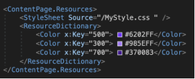

рисунок 1. ResourceDictionary

Каждый ресурс должен иметь ключ, задаваемый с помощью атрибута x:Key. Это своего рода уникальный идентификатор ресурса.

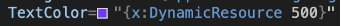

рисунок 2. обращение к ресурсам в коде

Чтобы обратиться к этому ресурсу в коде, надо использовать расширение DynamicResource. Стоит отметить, что если DynamicResource не найдет нужного ресурса по ключу, то никакой ошибки не возникнет, и приложение также будет работать.

`	`Для позиционирования элементов в данном проекте был выбран класс AbsoluteLayout, который используется для позиционирования и задания размера дочерних элементов с использованием явных значений, а также реализует функцию пропорционального позиционирования и задания размера.

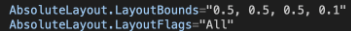

рисунок 3. Позиционирование элементов с помощью AbsoluteLayout

AbsoluteLayout.LayoutFlags свойство позволяет установить флаг, который указывает, что значения положения и размера границ макета для дочернего элемента пропорциональны размеру AbsoluteLayout . При размещении дочернего элемента AbsoluteLayout соответствующим образом масштабирует значения положения и размера для любого размера устройства. 

Перечисление AbsoluteLayoutFlags:

- **None** - указывает, что значения будут интерпретироваться как абсолютные. Это значение по умолчанию
- **XProportional** - указывает, что ***X*** значение будет интерпретироваться как пропорциональное, а все остальные значения будут рассматриваться как абсолютные.
- **YProportional** - указывает, что ***Y*** значение будет интерпретироваться как пропорциональное, а все остальные значения будут рассматриваться как абсолютные.
- **WidthProportional** - указывает, что значение длины будет интерпретироваться как пропорциональное, а все остальные значения будут рассматриваться как абсолютные.
- **HeightProportional** - указывает, что значение ширины будет интерпретироваться как пропорциональное, а все остальные значения будут рассматриваться как абсолютные.
- **PositionProportional** - указывает, что значения ***X*** и ***Y*** будут интерпретироваться как пропорциональные, тогда как значения размера будут интерпретироваться как абсолютные.
- **SizeProportional** - указывает, что значения длины и  ширины будут интерпретироваться как пропорциональные, тогда как значения позиции будут интерпретироваться как абсолютные.
- **All** - указывает, что все значения будут интерпретироваться как пропорциональные.

Положение и размер дочерних элементов в AbsoluteLayout определяются путем установки AbsoluteLayout.LayoutBounds прикрепленного свойства каждого дочернего элемента с использованием абсолютных или пропорциональных значений. Свойство AbsoluteLayout.LayoutBounds можно задать с использованием двух форматов, независимо от того, используются ли абсолютные или пропорциональные значения:

- x, y. В этом формате значения ***X*** и ***Y*** указывают положение верхнего левого угла дочернего элемента относительно его родителя. Дочерний элемент не имеет ограничений и сам изменяет свой размер.
- x, y, width, height. В этом формате значения  ***X*** и ***Y*** указывают положение верхнего левого угла дочернего элемента относительно его родителя, а значения width и height указывают размер дочернего элемента.

Кнопка смены темы спозиционирована с помощью AbsoluteLayout и имеет несколько дополнительный свойств, таких как:
BackgroundColor - цвет заднего фона кнопки, применяется в зависимости от текущей темы приложения
TextColor - цвет текста на кнопке, применяется из словаря ресурсов ResourceDictionary, созданного ранее. В данном случае выбран цвет с ключом 500, в котором прописан Hex код #6202FF.

Text - текст, отображаемый на кнопке
Clicked - метод, который вызывает функцию при нажатии на кнопку

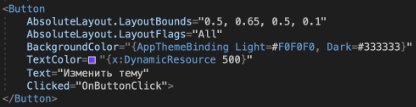

рисунок 4. Кнопка смены темы

Кнопка смены темы в данном проекте открывает стандартный DisplayAlert выбора с двумя кнопками: темная или светлая тема

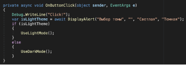

рисунок 5. Функция OnButtonClick

В первую очередь функция OnButtonClick печатает в консоль “Click!” как отладочное действие. Далее создается булева переменная isLightTheme, которая содержить в себе ответ на вопрос: светлая ли тема сейчас выбрана? Для ответа представляется системный алерт, который предлагает на выбор 2 варианта: “светлая” или “темная”. В тело вывода предупреждения можно передать еще параметр подтекста, но его оставим пустым, передав “” без текста внутри. Затем проверяем какая тема выбрана (какое значение в переменной isLightTheme) и исходя из этого вызываем либо функцию UseLightMode, если тема выбрана светлая, либо UseDarkMode, если выбрана темная тема.

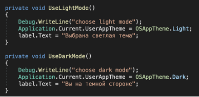

рисунок 6. Функции UseLightMode и UseDarkMode

Функции UseLightMode и UseDarkMode в первую очередь печатают в консоль какая выбрана тема как отладочное действие. Затем устанавливают Application.Current.UserAppTheme соответственно в светлое и темное оформление через свойства OSAppTheme.Light и OSAppTheme.Dark. И меняют текстовый label на главном экране.

Слайдер тоже спозиционирован с помощью AbsoluteLayout и имеет несколько дополнительный свойств, таких как:
x:Name - имя слайдера для обращения к нему из других файлов
Minimum и Maximum - начальное и конечное положение слайдера

MinimumTrackColor - цвет слайдера слева до разделяющего указателя, применяется из словаря ресурсов ResourceDictionary, созданного ранее. В данном случае выбран цвет с ключом 700, в котором прописан Hex код #370083.

MaximumTrackColor - цвет слайдера справа после разделяющего указателя, применяется из словаря ресурсов ResourceDictionary, созданного ранее. В данном случае выбран цвет с ключом 300, в котором прописан Hex код #985EFF.

ThumbColor - цвет указателя текущего значения

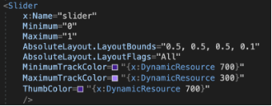

рисунок 7. настройка параметров слайдера

Slider также позволяет установить минимальное и максимальное, а также текущее значение. И также изменение значения можно обработать с помощью обработки события ValueChanged. Стартовое значение слайдера установим посередине в функции, которая запускается при старте приложения

рисунок 8. установка начального положения слайдера

Label представляет обычную текстовую метку, которая выводит информацию с помощью свойства Text. Label удобен для создания заголоков и меток к элементам ввода. Текстовый label тоже спозиционирован с помощью AbsoluteLayout и имеет несколько дополнительный свойств, таких как:
x:Name="label" - имя labela для обращения к нему из других файлов
StyleClass- стиль, применяемый к данному текстовому полю, он прописан в отдельном файле с расширением .css 

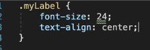

рисунок 9. стиль текстового поля

Text - введенный в поле текст

TextColor - цвет текста

Opacity - прозрачность текста

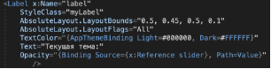

рисунок 10.  настройка параметров текстового поля

Opacity параметр текстового поля будем менять в зависимости от значения источника - в данном случае слайдера. Для этого применим конструкцию "{Binding Source={x:Reference slider}, Path=Value}".
# **Выдержки из исходных текстов**
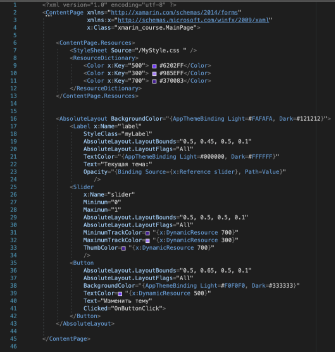

Листинг 1. MainPage.xaml

Листинг 2. MainPage.xaml.cs
# **Скриншоты или видео работы программы**
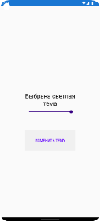          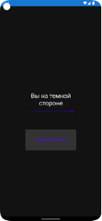

рисунок 1. Главный экран в светлой теме или темной теме

          

рисунок 2. Alert выбора темы

рисунок 3. Действие слайдера

# **Вывод**
В ходе данной лабораторной работы я познакомился со средой разработки Visual Studio и Xamarin.Forms, которая представляет платформу, которая нацелена на создание кроссплатформенных приложений под Android, iOS. Создал Xamarin.Forms проект в котором реализованы: Различные элементы управления (не менее двух), привязки данных, обработчики событий, корректная работа интерфейса на различных (эмулируемых или физических) устройствах.

# **Приложение**
GitHub:  <https://github.com/K1selev/Xamarin>

Zip-архив: [xmarin_course.zip](https://drive.google.com/file/d/1Twu_iAYAUqhyB-tm0RS8GuYEDxzvbD1R/view?usp=sharing)

