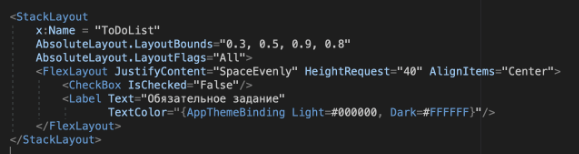
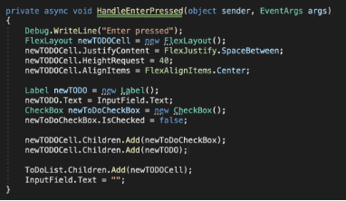
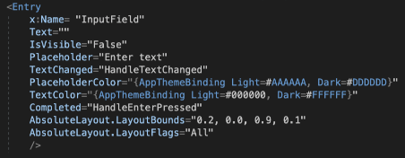
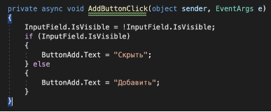
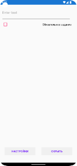
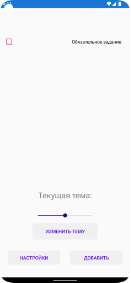
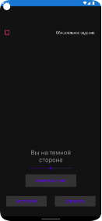
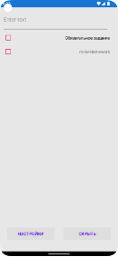
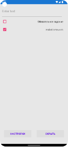

# **Цель**
Целью данной лабораторной работы является создание и организация Xamarin.Forms проект на основе общей кодовой базы, реализующей бизнес-логику приложения. Создание интерфейса на основе XAML, корректно отображающийся и функционирующий на различных устройствах.

# **Описание проведённой работы**
В ходе данной лабораторной работы был дополнен Xamarin.Forms проект, созданный в прошлой лабораторной работе. Этот проект имеет несколько новых элементов управления и представляет собой простейшее приложение таск трекера. В данном приложении реализовано добавление новых задач с возможностью отметки их как выполненных. Данный пример имеет уже заранее созданное событие “Обязательное задание”. Для отображения списка был создан объект StackLayout.

Внутрь этого объекта был помещен объект FlexLayout для правильного размещения элементов событий. Остальные объекты добавляются туда с помощью функции HandleEnterPressed, которая обрабатывает нажатие на кнопку ввода/enter при редактировании текстового поля для ввода. 

Внутри FlexLayout разместил объект CheckBox, который позволяет отмечать выполненность задачи и Label, который выводит текст задачи. Добавил эти объекты с помощью свойства .Children.Add(). 
Для ввода данных был использован объект Entry, который представляет собой текстовое поле для ввода данных. 

Этот объект располагается вверху экрана устройства, предзаполненное текстовое поле помогает пользователю сориентироваться и подсказывает, что в это текстовое поле необходимо ввести текст. Свойство Completed регистрирует нажатие кнопки ввода на клавиатуре и вызывает функцию HandleEnterPressed, описанную выше. Также цвета текстов в этом поле изменяются, в зависимости от темы устройства.

Также было добавлены две кнопки: ButtonAdd и ButtonSettings, которые отвечают за изменение видимости элементов, по сути открывая новый функционал. Кнопка ButtonAdd изменяет видимость текстового поля для ввода текста, а также меняется и текст на этой кнопке: 

А кнопка ButtonSettings изменяет видимость функционала из прошлой лабораторной работы, делая его видимым или скрытым от пользователя.

За видимость элементов отвечает свойство IsVisible, которое пристуствует практически у каждого элемента на экране. 

# **Скриншоты или видео работы программы**
           

рисунок 1. Главный экран c добавлением записи

          

рисунок 2. Сохранение настроек из прошлого проекта

          

рисунок 3. добавление задачи и отметка ее как выполенной
# **Вывод**
В ходе данной лабораторной работы я дополнил Xamarin.Forms проект, созданный в прошлой лабораторной работе. Этот проект имеет несколько новых элементов управления и представляет собой простейшее приложение таск трекера. В данном приложении реализовано добавление новых задач с возможностью отметки их как выполненных.

# **Приложение**
GitHub:  <https://github.com/K1selev/Xamarin/tree/lab2> 

Zip-архив: [xmarin_course_2.zip](https://drive.google.com/file/d/1YLdothf4Vzv8nhmBQCLqZ_7yURcTRJBF/view?usp=sharing) 
